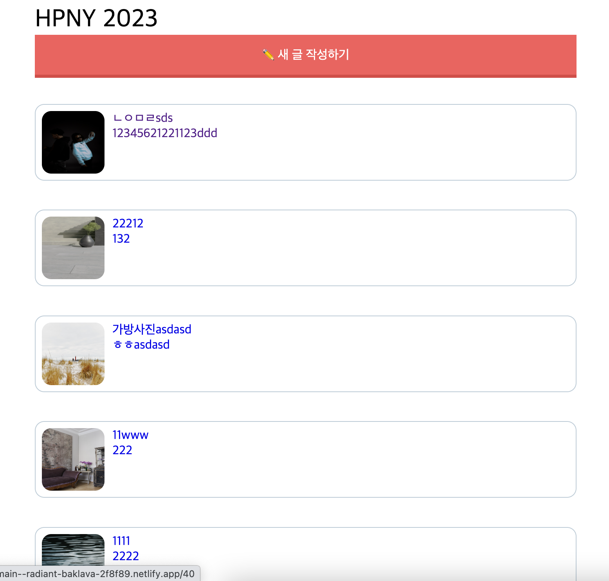
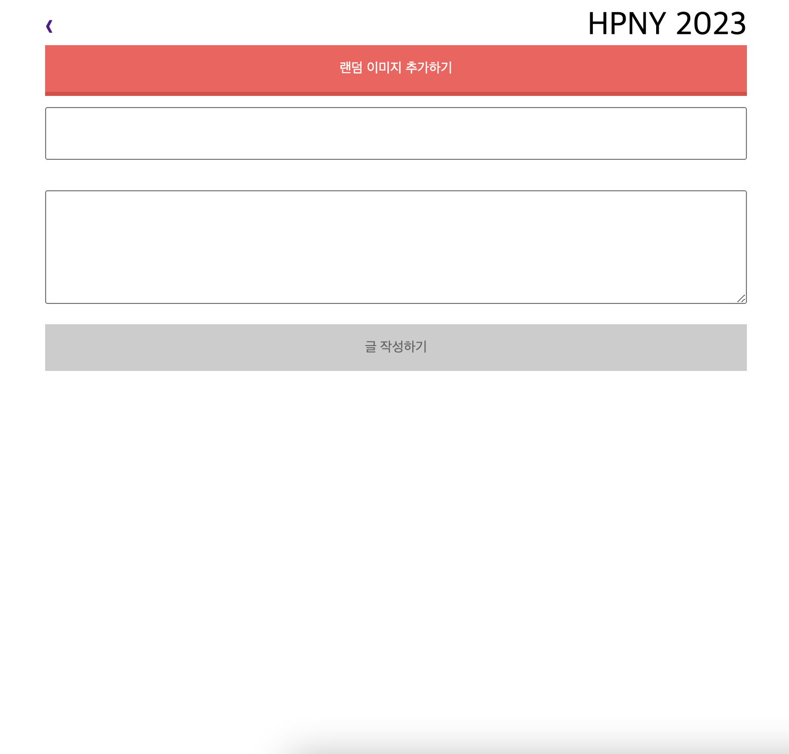
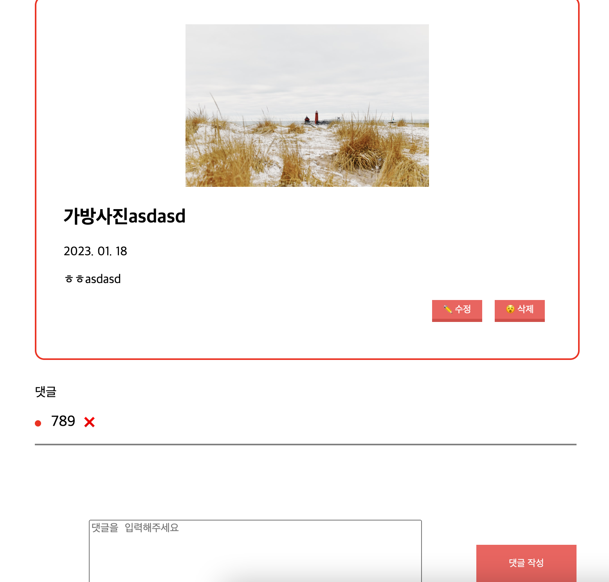

# 바닐라 JS로 신년 메시지 앱 만들기

이 레파지토리는 넘블에서 진행한 [챌린지](https://www.numble.it/501cc258-649f-4c73-b64b-bb4fea000640)입니다.

## 결과

[배포된 화면 확인](https://main--radiant-baklava-2f8f89.netlify.app/)
[회고록](https://velog.io/@apsn2000/Vanilla-JS%EB%A1%9C-%EC%8B%A0%EB%85%84-%EB%A9%94%EC%8B%9C%EC%A7%80-%EC%95%B1-%EB%A7%8C%EB%93%A4%EA%B8%B0-%ED%9A%8C%EA%B3%A0)

## 실행 방법

1. 프로젝트 클론
2. `npm i`를 통해 라이브러리 다운로드
3. `node server.js`로 서버 실행
4. 로컬호스트 포트 3000번으로 접속

> 💡 현재 배포된 상태에서 http 요청을 가능하도록 하기 위해 redirect 설정이 들어가 있어 로컬에선 API 통신이 제대로 되지 않을 수 있습니다.
> 이 경우 API의 URL을 `api`대신 `http://43.201.103.199`를 쓰면 해결됩니다.

## 주요 기능

### 인덱스 페이지

- [x] 신년 메시지 리스트와 새 메시지를 추가할 수 있는 버튼이 있다.

### 신년 메시지 추가 페이지

- [x] 랜덤 이미지를 추가할 수 있는 버튼이 있다.
- [x] 신년 메시지 제목과 내용을 입력할 수 있는 입력창이 있다.
- [x] 이미지와 제목, 내용이 모두 있다면 신년 메시지를 추가할 수 있는 버튼이 활성화되고, 인덱스 페이지로 이동한다.

### 상세 신년 메시지

- [x] 신년 메시지의 제목과 내용, 그리고 이에 대한 댓글들을 확인할 수 있습니다.
- [x] 수정 버튼을 누르면 신년 메시지의 제목, 내용을 편집할 수 있습니다.
- [x] 신년 메시지를 삭제할 수 있으며, 삭제하면 인덱스 페이지로 돌아갑니다.
- [x] 신년 메시지에 대한 댓글을 남길 수 있습니다.
- [x] 남긴 댓글을 삭제 할 수 있습니다.

## 화면 스크린샷

### 인덱스 페이지

### 신년 메시지 생성 페이지

### 신년 메시지 상세 페이지

